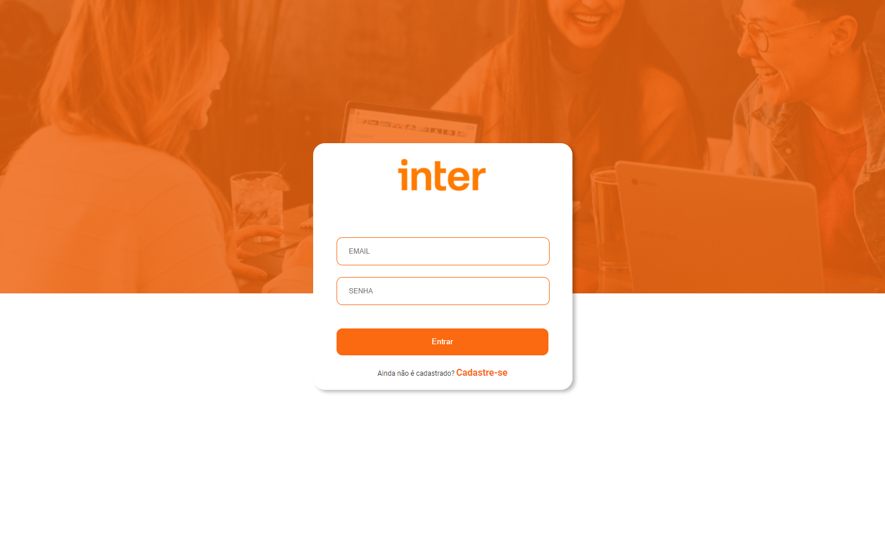
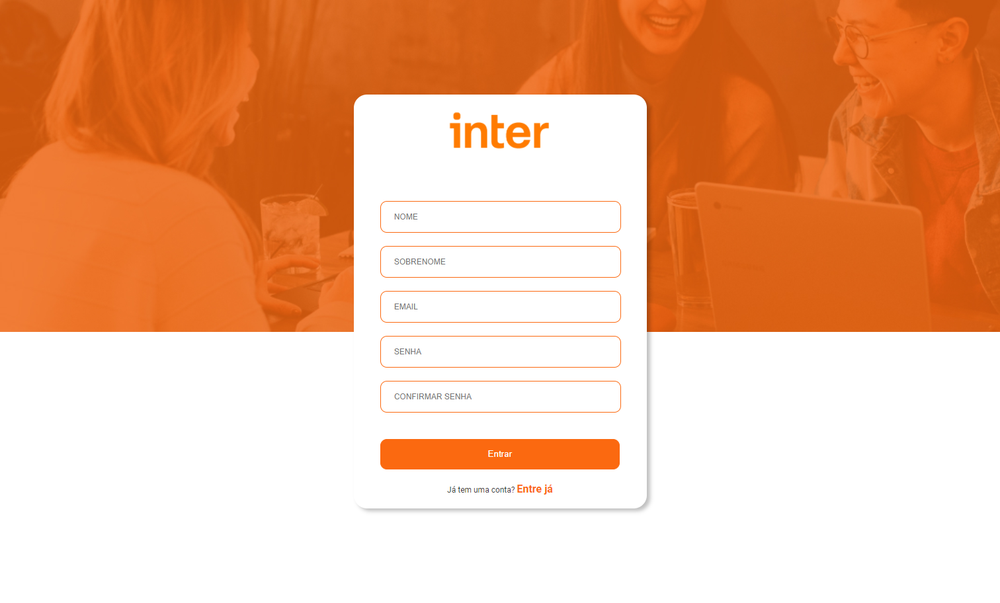
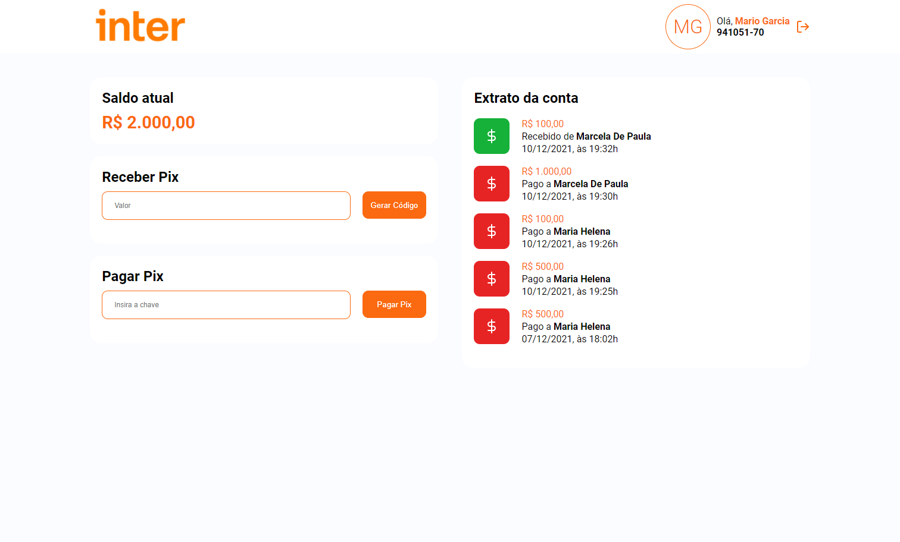

# Front-end

## Sobre o projeto

Aplicação front-end da jornada da Semana Front-End Inter ofertado pelo banco Inter em conjunto com a DIO, ministrado por Pablo Henrique.

Nesta etapa é desenvolvido toda a parte visual do projeto, sendo as paginas de signin, singup e dashboard. O Front-End fornece suporte na interação visual do usuário com a aplicação.

## Iniciando o projeto

### `yarn install`

### `yarn start`

Executando a aplicação em modo de desenvolvimento. `http://localhost:3000`

### /singin

### /singup

### /dashboard

